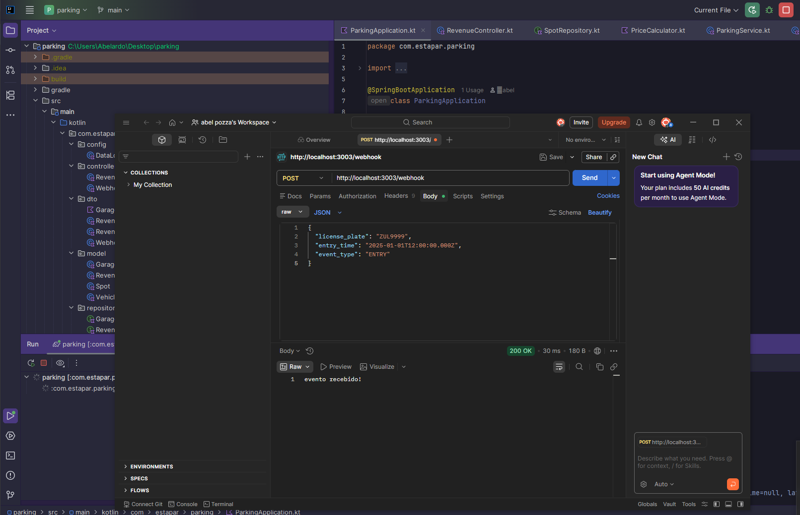
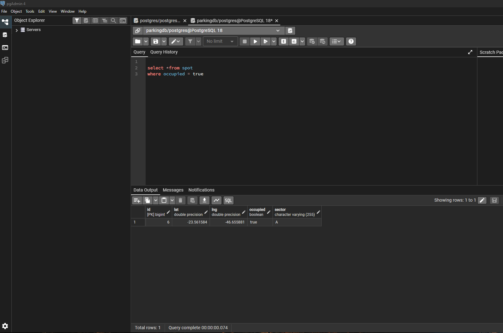
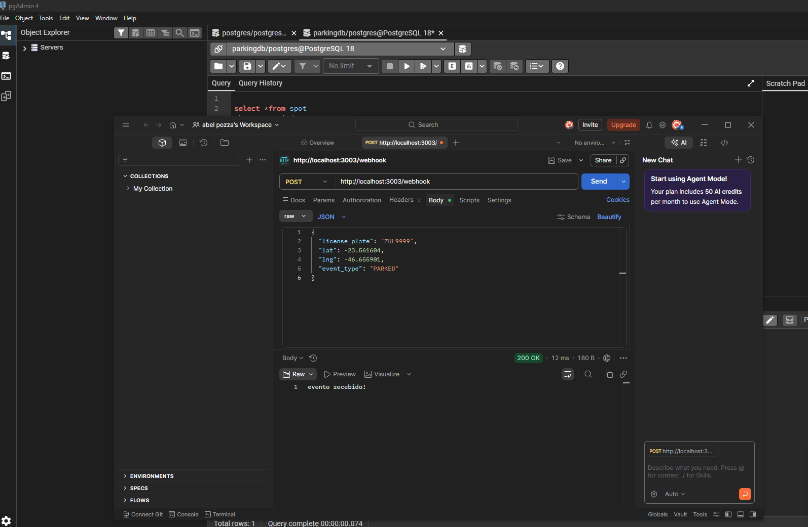
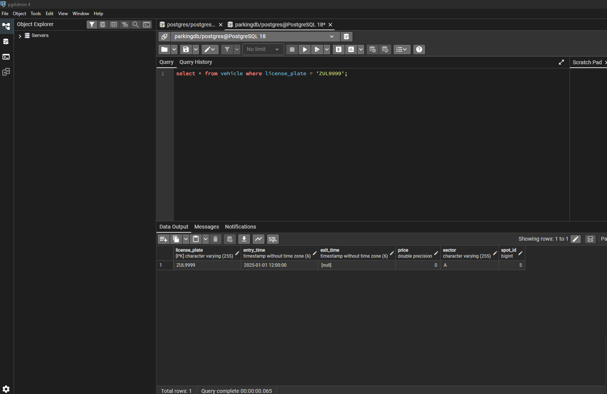
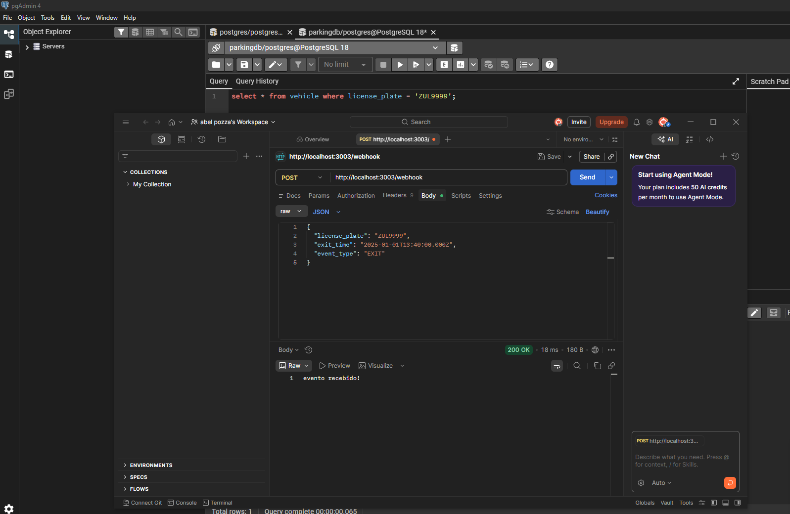
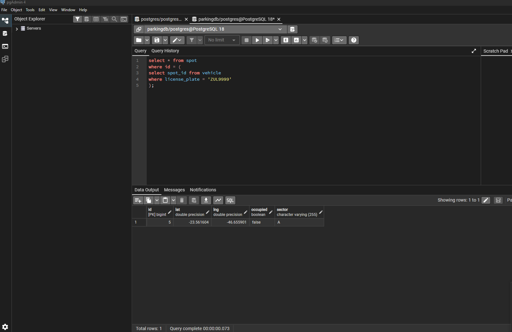
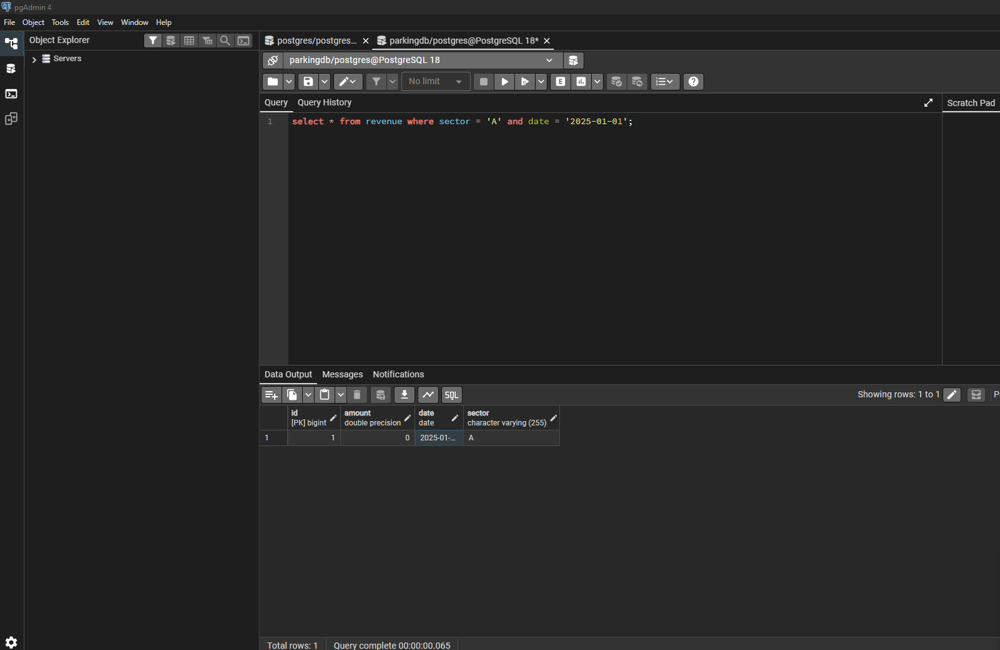
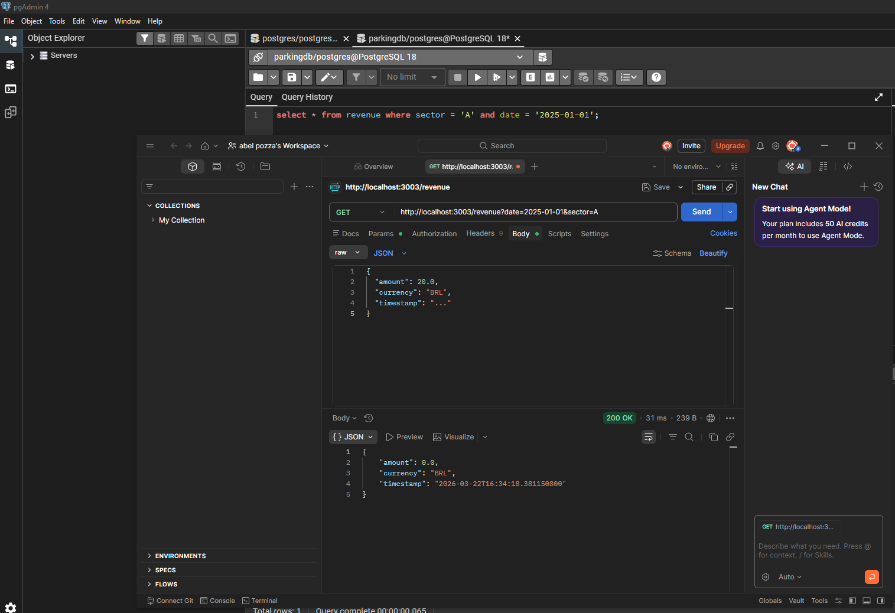

COMO RODAR O PROJETO

1 - Subir o simulador

No terminal:

bash
docker run -d -p 3000:3000 cfontes0estapar/garage-sim:1.0.0

2- dar Run na aplicação (usei IntelliJ IDEA)

3- aplicação sobe aqui:
http://localhost:3003

4- ao iniciar:
chama automaticamente - GET http://localhost:3000/garage

salva setores (garage) e vagas (spots) no Banco de dados

5- faz endpoints via POST /webhook

PARA TESTAR VIA POSTMAN:

- preencher o body de acordo com status (entry, parked e exit)
- preencher Headers (key = Content-Type) e (Value = application/Json)

- ENTRY -
  {
  "license_plate": "ZUL0001",
  "entry_time": "2025-01-01T12:00:00.000Z",
  "event_type": "ENTRY"
  }

- PARKED -
  {
  "license_plate": "ZUL0001",
  "lat": -23.561684,
  "lng": -46.655981,
  "event_type": "PARKED"
  }

- EXIT -
  {
  "license_plate": "ZUL0001",
  "exit_time": "2025-01-01T13:40:00.000Z",
  "event_type": "EXIT"
  }

6 - CONSULTAR REVENUE
GET /revenue?date=2025-01-01&sector=A
Deve retornar:
{
"amount": 0.0,
"currency": "BRL",
"timestamp": "2025-01-01"
}

--------------------------------------------------------------------------------

Parking API 

Projeto backend feito em Kotlin + Spring Boot para gestão do estacionamento.

A ideia aqui foi construir um sistema simples que:
- controla vagas
- recebe eventos via webhook
- calcula preço baseado no tempo e lotação
- salva tudo no banco
- e permite consultar faturamento

O QUE O PROJETO FAZ

O fluxo funciona da seguinte forma:

Request → Controller → Service → Repository → Banco

- Recebe eventos ('ENTRY', 'PARKED', 'EXIT')
- Processa regras de negócio
- Atualiza as vagas
- Calcula preço
- Salva no banco
- Permite consultar receita

TECNOLOGIAS USADAS

- Kotlin
- Spring Boot
- Spring Data JPA
- PostgreSQL
- Docker
- Gradle
- Postman

8- Observações:

- utilizei SpotId no veículo para garntir que libere a vaga correta no EXIT
- utilizei lat/lng no PARKED para identificar vaga sem erros
- camadas separadas (controller, serviice, repository)
- carregamento automatico da garagem ao subir a aplicação

9- PRINTS DO PROJETO

Entrada de veículo (ENTRY via Postman)

-

Vaga sendo ocupada

-

Evento PARKED recebido

-

Veículo salvo com spotId

-

Evento EXIT enviado

-

Vaga liberada após saída

-

Revenue sendo salva no banco

-

Endpoint GET /revenue funcionando

